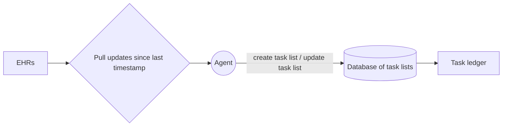

# Team 12 — Close The Loop: tasks, ledger and latency

Source of truth for this document: the team's own product notes and architecture diagram,
transcribed below, reconciled against what the Anima simulator actually supplies (verified
2026-09-12 against world `team-ea32f6302052`, team `team12`).

Read this alongside [`care-covenant-product-and-safety.md`](care-covenant-product-and-safety.md).
Where this document and the safety model appear to conflict, the reconciliation rules in section 4
govern, because they are what keep the product honest.

## 1. The product, in the team's words

**Problem** (from the updated deck, verbatim in substance):

- There is a lack of transparency into tasks tracked for patients. Unexpected tasks, if not
  prioritised, can be lethal.
- There is no system in place that can speak to patients at home on a regular basis, following up
  with their symptoms.
- Existing software keeps track of tasks requested *by* patients, when it should be the other way
  round.

Restated: clinical work is started and not closed. Tasks live in free-text notes, in orders with no
result, and in results with no follow-up, spread across fragmented EHR sources. Nobody holds the
gap.

**Basic functionality.**

- Input the patient's records: documents, notes, clinical requests/orders and results.
- From the free-text notes and labs, extract tasks that need to be actioned. These include reading
  "Book follow up appointment in 4 weeks" or "Chase blood culture results" from free-text notes.
  Free text could be mapped into a task tag drawn from a **bank of potential tasks**.
- Some tasks can be inferred from incomplete actions in the EHR, such as a blood test with no
  result yet — meaning a clinician needs to wait until the result is released and then act on it.
- Extract the timestamps and values from each entry and recreate a clinical workflow timeline
  (a ledger plus a specific task schema).

**Goals.**

- Parse the fragmented EHR data sources for clinical tasks, surface unexecuted tasks, and display
  them in a dashboard along with key metrics of workflow latency.
- Have an effectuator agent that can action the work, or reduce the friction for completing it:
  organise a follow-up, request a blood test, or book a review call itself.
- Surface the latency of each workflow step, so an admin can see the critical bottlenecks and
  time-sinks in each clinical workflow.
- Scheduled jobs ("ChronJobs") that keep the ledger current and close the loop.
- Compare the ledger against subsequent actions and free text to detect what was never closed.

**Ways to improve (future, not now).** NICE guidelines, BNF checks, latent decision making
(gathering actions for similar patients across different hospital visits), SNOMED coding,
prediction, coordination, QOF.

## 2. Architecture from the diagram

An episode groups tasks: `{ tasks: [task ids], episode_id: string }`.

## 3. Task ledger schema, as specified by the team

| # | Field | Type |
|---|---|---|
| 1 | `episode_id` | string |
| 2 | `timestamp` | datetime |
| 3 | `task_id` | string |
| 4 | `status` | string |
| 5 | `owner` | clinician_id |
| 6 | `note` | string |
| 7 | `deadline` | timestamp |
| 8 | `clinical_priority` | enum: emergency, urgent, standard |
| 9 | `snomed_id` | string |
| 10 | `performed_by` | clinician_id |
| 11 | `sample_id` | id |
| 12 | `requested_by` | clinician_id |

The ledger is append-only: each entry is an observation of a task at a point in time, and the
timeline is reconstructed by replaying entries in `timestamp` order. A task's current state is
derived, never edited in place.

### 3a. The formal schema, and the conflict it creates

The updated deck specifies a JSON Schema (draft 2020-12), `title: "ClinicalTaskEpisode"`, with
`additionalProperties: false` and **all twelve fields in `required`**, every one typed `string`
(`timestamp` and `deadline` as `format: date-time`; `clinical_priority` as an enum of
`emergency | urgent | standard`; `owner`, `performed_by` and `requested_id` each described as a
"Clinician identifier"; `snomed_id` as a "SNOMED CT concept identifier"). Note the field is
`requested_id`, not `requested_by`.

**This schema cannot be satisfied honestly against the simulator, and satisfying it literally would
force the system to invent clinical data.** Concretely:

1. `snomed_id` is required and typed `string`, but there is no SNOMED anywhere in the simulator
   (verified: zero matches; codes are local `SIM-PROBLEM-N`). A required string field means every
   entry must carry a SNOMED CT concept id, so the only way to emit a conforming entry is to
   generate one. Generating a clinical code is a mis-coding hazard that propagates downstream.
2. `sample_id`, `performed_by` and `requested_id` are required, and no corresponding field exists on
   any captured record.
3. `owner`, `performed_by` and `requested_id` are described as clinician identifiers, but simulator
   attribution is **team-level** — `provenance.changes[].actor.kind` is `'team'` and an `Action`
   carries no staff field. A clinician identifier from the source does not exist.
4. `clinical_priority` is required with a three-value enum and no "unknown" member. Source tasks
   sometimes carry `priority` (real example: `'urgent'`) but often carry none. A required enum forces
   a default, and defaulting to `standard` is a clinical judgement the system is not permitted to
   make. Note the deck's own problem statement — "unexpected tasks, if not prioritised, can be
   lethal" — which is precisely why a *fabricated* priority is worse than an absent one.
5. `timestamp` and `deadline` as ISO date-time strings lose the distinction between **simulator
   time** and wall-clock time. The captured world runs paused at speed 60 from epoch
   1789286400000; an ISO string with no marker invites someone to read simulator time as real time.

**Resolution adopted.** The internal ledger (`src/tasks/types.ts`) keeps provenance mandatory in the
type system: a present value must cite the source field that supplied it or the rule that derived
it, and `snomedId` is source-only, so an invented code is a compile error. For interchange we emit
the team's `ClinicalTaskEpisode` shape through an explicit boundary that either
(a) widens the unavailable fields to `["string", "null"]` and records the deviation, or
(b) refuses to emit an entry it cannot populate from the source, and says which field was missing.
It must never silently fill a required field. If the team wants strict conformance to the schema as
written, that is a decision to take knowingly, and the honest options are to relax `required`, add a
null union, or add an `unknown` member to the priority enum.

## 4. Reconciliation with what the simulator actually supplies

Verified by inspecting the captured GP view for `SIM-000001` (95 resources across task, message,
capacity, ehr-record, encounter, observation, appointment, discharge-summary, appointment-session,
conversation, message-template and report).

**Available from the source, use directly.**

- `clinical_priority` — source tasks DO carry a priority. The real task `r-2` reads
  `{ id:'r-2', kind:'task', title:'Arrange post-discharge monitoring', status:'open',
  priority:'urgent', owner:'gp', dueAt:1789286400000, version:1 }`. Priority is therefore a
  **source-supplied** field.
- `status`, `deadline` (`dueAt`), `timestamp` (`createdAt`, and `provenance.created.time`),
  `owner` (a team, see below) and task identity all come from the record.
- `provenance.created{actor{kind,name},time,action,source,version}` and `provenance.changes[]` give
  real attribution and version history.
- Problem lists carry local codes and terms, e.g.
  `{ code:'SIM-PROBLEM-2', term:'CKD', status:'active', date:'2026-05-15' }`.

**NOT available from the source — must never be fabricated.**

- **SNOMED.** There is no SNOMED anywhere in the simulator: a scan for `snomed`/`SNOMED` returns
  zero matches, and clinical codes are local synthetic identifiers of the form `SIM-PROBLEM-N`.
  So `snomed_id` must be nullable and rendered as "not supplied by source". An agent must NEVER
  generate a SNOMED code: guessing a clinical code is a mis-coding hazard, not a convenience.
- **`sample_id`, `requested_by`, `performed_by`.** No `sampleId`, `requestedBy`, `orderedBy` or
  equivalent field exists on the captured records. These stay nullable unless a specific source
  field is found and cited. Do not infer who requested something from surrounding text.
- **Clinician-level identity.** Simulator attribution is team-level: an `Action` has no staff field,
  and `provenance.changes[].actor.kind` is `'team'` (confirmed by a probe write). So
  `owner`/`performed_by`/`requested_by` are team-level from the source, and any clinician-level
  identity is **app-side** and must be labelled as such. Never write an app-side staff name into a
  record as though the source recorded it.
- **`episode_id`.** Episode grouping is sparse in the captured data. Derive it deterministically
  (for example from the encounter or discharge-summary a task hangs off) and record the derivation
  rule next to the value, or leave it null. Never invent an episode boundary.

**Free-text extraction rules.** Extracting an explicit instruction a clinician actually wrote
("Book follow up appointment in 4 weeks") is extraction. Deciding that a patient needs a follow-up
nobody wrote is clinical inference and is forbidden. Therefore:

- Every extracted task must carry a citation: the source resource id, its version, and the exact
  quoted span the task came from. A task with no quoted source span must not enter the ledger.
- An extracted task is a **proposal** until a human accepts it. It is labelled as agent-extracted,
  with its confidence expressed as the citation itself rather than a score.
- Tasks inferred from structural gaps (an order with no result) are permitted, because the gap is a
  fact in the data, not a judgement. The rule that detected the gap must be displayed in words,
  exactly as the existing abnormality rule is.
- Free text is redacted out of committed fixtures by `scripts/preflight.ts`, so extraction work must
  run against the live simulator, never against the redacted captures.
- `clinical_priority` may only be populated from a source-supplied priority. An agent must never
  assign or upgrade urgency. If the source gives no priority, the field is null and displays as
  "no priority supplied by source" — not "standard".

**Prioritisation is not ours to do.** The deck's motivation is that unprioritised tasks can be
lethal, which makes it tempting to have the system rank work. It must not. What the system may do
is surface (i) the priority the source itself supplied, (ii) the fact that a task is outstanding,
(iii) how long it has been outstanding, and (iv) that its deadline has passed. Those are facts.
"This task matters more than that one" is a clinical judgement and stays with the clinician.

**Talking to patients at home.** The deck asks for regular follow-up contact about symptoms. The
simulator does expose messaging, conversations and message templates, so this is buildable — but
only against synthetic `SIM-*` patients, never real messaging, and every outbound contact goes
through the same human approval gate and the same evidence rules as any other write: submitted is
not delivered, and delivered is not "the patient understood". Symptom responses collected this way
are patient-reported inputs, never a triage verdict.

**The effectuator that acts.** "Organise a follow-up, request a blood test, book a review call
itself" is a write, so it inherits every existing constraint without exception: the agent proposes,
a human approves the exact thing they were shown, only the execution service writes, the action
carries an idempotency key, and an HTTP 200 means submitted rather than done. Requesting a blood
test is a clinical order — it may only ever be proposed for a human to approve, never issued
autonomously.

**The task tag bank is the safe version of extraction.** Mapping free text onto a closed vocabulary
of known task kinds is far safer than letting a model invent a task description, and it matches the
existing `src/tasks/task-kinds.ts` design. The tag must still carry the quoted source span that
produced it, and text that matches nothing in the bank must surface as unmapped rather than be
forced into the nearest tag.

**Out of scope for now, and why.** NICE guidance, BNF checks and QOF all require the system to
assert clinical correctness. That is exactly the line this product does not cross. If they are ever
added, they must appear as citations to a named guideline for a human to read, never as a
system-generated recommendation or a compliance verdict.

## 5. How this relates to what is already built

The existing Care Covenant slice is one specialised, fully-evidenced instance of this ledger: the
task of transferring accountability for an abnormal blood result.

| Close The Loop concept | Existing implementation |
|---|---|
| Task ledger entry | `EventEnvelope` in `src/domain/types.ts` (append-only, replayed in order) |
| Current task state | `CovenantCase`, derived by `src/domain/case-reducer.ts` |
| Owner, never blank | `currentAccountableOwner` plus invariant 9 |
| Deadline | `deadlines.ackDeadlineAt`, derived from the protocol, not the payload |
| Workflow latency | `TwinMetrics` in `src/domain/twin.ts` |
| Effectuator agent | `src/agents/*` proposing, `src/services/execution-service.ts` writing after approval |
| Pull updates since last timestamp | to build — the incremental sync |
| Unexecuted task surface | to build — the cross-patient queue |
| Dashboard of latency metrics | to build — currently one case, denominator of one |

So the generalisation is: keep the reducer-and-evidence discipline, and widen the task vocabulary
beyond the single handover task. Everything the covenant guarantees — always-owned, source-only
classification, HTTP 200 is not proof, approval binds to what was shown, append-only evidence —
applies unchanged to every task type added.

## 6. Non-negotiables carried forward

- Accountability is never blank, for every task in the ledger.
- Nothing infers clinical meaning: no urgency, no diagnosis, no treatment, no coding.
- Agents propose; only the execution service writes, and only after a human approves the exact thing
  they were shown.
- An HTTP 200 means submitted. Downstream visibility needs a readback; an audit claim needs an
  audit record.
- Every metric states its denominator.
- Synthetic `SIM-*` patients only; team credentials stay server-side; no real messaging.
