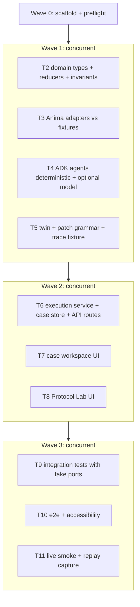

# Care Covenant v1 Implementation Plan

> **For agentic workers:** REQUIRED SUB-SKILL: Use superpowers:subagent-driven-development to implement this plan task-by-task. The orchestrator dispatches implementer workers; tasks inside one wave touch disjoint directories and MAY run concurrently. Every task is TDD: failing test first, minimal code, green, commit. Steps use checkbox (`- [ ]`) syntax for tracking.

**Goal:** Ship the five-hour Care Covenant vertical slice: one live, human-approved, schema-bound Anima write with readback and Activity evidence; a deterministic always-owned covenant reducer; a bounded protocol patch replayed through an operational-latency twin; one honest case workspace UI.

**Architecture:** Ports-and-adapters around a pure TypeScript domain core (`src/domain`). Anima simulator access lives only in Next.js server code (`src/adapters/anima`, route handlers). The three bounded agents are built on `@animahealth/adk` (`src/agents`): deterministic `app.step`s are the default path; a model-backed `app.agent` with a Zod `output` schema is used only when `OPENAI_API_KEY` is set, and its output is validated by the same code gates. Human approval is an ADK yielding tool. The twin (`src/domain/twin.ts`) replays one immutable trace through the same reducer under two protocol versions and never touches a write port.

**Tech Stack:** Node 22, pnpm 11, Next.js 16 (App Router, TypeScript), `@animahealth/adk@^0.6.0`, `zod@^3.25` (ADK peer range; do NOT use zod 4), Vitest 5, Playwright 1.63 (+ `@axe-core/playwright`), `tsx` (dev) for scripts.

## Global Constraints

Copied from the approved design (`docs/superpowers/specs/2026-09-12-care-covenant-design.md`) and `docs/context/*`:

- Five-hour boundary is fixed. Cut order if squeezed: decorative motion, extra evidence detail, multiple eligible-patient choices, live clock advance. Never cut: live write/readback, always-owned rule, deterministic twin, invariant report, honest fallback labels.
- Team bearer key (`ANIMA_SIM_API_KEY`) is server-side only: never in browser bundles, prompts, logs, fixtures, screenshots, or git. `.env.local` is git-ignored already.
- Only synthetic simulator patients (`SIM-*`). No real data, no real messaging.
- Agents propose; they never write. Only `ExecutionService` calls `AnimaWritePort`, and only with a current human approval, current source versions, a staff identity and an idempotency key.
- Abnormality comes from the source or the displayed deterministic rule; the model never classifies. Rule text (verbatim, displayed in UI): `An analyte value lies outside the reference range supplied by the source laboratory (referenceLow..referenceHigh). No urgency, diagnosis or treatment is inferred.`
- HTTP 200 on a write == `SUBMITTED` only. State advances only from a matching readback (`VISIBLE_DOWNSTREAM`) and an Activity record (`EVIDENCED`).
- Ownership states: `ORDERER_OWNS -> TRANSFER_REQUESTED -> ACCEPTED`, branches `DECLINED`, `OVERDUE`, `OWNER_UNAVAILABLE`, `STALE`. `currentAccountableOwner` is never blank.
- Closure states: `RESULT_AVAILABLE -> CLINICALLY_REVIEWED -> PLAN_RECORDED -> PATIENT_INFORMED -> ACTION_STARTED -> OUTCOME_EVIDENCED -> CLOSED`; branches `PATIENT_UNREACHED`, `ACTION_NOT_BOOKED`, `ACTION_MISSED`, `PLAN_CHANGED`, `EVIDENCE_LATE`, `REOPENED`.
- Idempotency basis: `team + patient + result-id + result-version + protocol-version + action-kind + destination`. Retries reuse the key.
- Patch grammar may change only: `receiverMode`, `ackDeadlineMinutes`, `fallbackTeamId`, `exceptionRoute`, `dedupeWindowMinutes`.
- Candidate lifecycle `DRAFT -> TESTING -> FAILED_INVARIANTS | PASSED -> PROPOSED`; stops at `PROPOSED`. Disabled deploy control text (verbatim): `Production activation requires named clinical and operational approvers, controlled rollout and a rollback target.`
- Labels (verbatim): `Protocol preview` (unsupported acceptance action), `Recorded simulator replay` (captured evidence, must show world ID + capture time), `simulator regression evidence` (twin report), `Clinician decision required` (locked clinical rows), `Current accountable owner: ordering team`.
- Twin comparison values are computed at runtime from replayed events; nothing hard-coded into presentation.
- No chat UI, agent personas, chain-of-thought, dashboards or inbox.
- Accessibility: keyboard path, visible focus, text+icon for each state, WCAG 2.2 AA contrast, live-region announcements, 200% zoom, reduced motion.
- Live preflight facts (captured 2026-09-12, world `team-ea32f6302052`, team `team12`, scopes gp/hospital/community/pharmacy/diagnostics/referrals/wearables):
  - `POST /api/sites/{site}/actions` body `Action` (`type` enum incl. `create_task`, `accept`, `complete`, `reject`, `process_document`, `messaging_action`); header `Idempotency-Key`; response `Resource` (id, version, owner, visibleTo, provenance.created{actor{kind,name},time,version}).
  - `GET /api/sites/{site}/view?patient=&offset=&limit=` -> `View{now, resources[], resourceTotal, resourceOffset, resourceLimit, events[]}`. Paginate on `resourceTotal`.
  - `GET /api/nhs/gp-connect?patient=` -> FHIR-ish `Bundle` of `Task` (id, status, meta.versionId). Readback surface for tasks.
  - Blood reports: `kind:"report"`, `data.kind:"blood-result"`, `data.analytes[{id,name,unit,value,referenceLow,referenceHigh}]`, `data.collectedAt`, `visibleTo:["gp","hospital","diagnostics"]`, `owner:"diagnostics"`. No explicit abnormal flag exists.
  - `GET /api/clock` -> `{now, paused, speed, events[]}`; `POST /api/clock {paused:true, advanceMinutes}`.
  - `Action` has no staff field; simulator attribution is team-level. Staff identity is therefore app-side and must be labelled as such.

## Execution model (orchestrator + workers)

- Orchestrator runs Wave 0 itself (scaffold, install, preflight) because it needs the human to approve the single probe write.
- Waves 1-3 dispatch implementer workers concurrently for tasks in the same wave. Tasks in a wave own disjoint directories (listed per task); a worker may only read, never edit, files outside its task's `Files:` list. Each worker: TDD, `pnpm test <its files>`, `pnpm typecheck`, commit on its own branch name `task/<n>-<slug>` from `main`; orchestrator merges wave branches in task order (fast-forward or trivial merge, since directories are disjoint), runs the full suite, then dispatches reviewers.
- Progress ledger: `.superpowers/sdd/progress.md` (git-ignored).



## File structure

```text
package.json, pnpm-lock.yaml, tsconfig.json, next.config.ts, vitest.config.ts, playwright.config.ts, eslint.config.mjs
.env.example                      # ANIMA_SIM_API_KEY, ANIMA_SIM_BASE_URL, OPENAI_API_KEY (optional), COVENANT_STAFF_ROSTER
scripts/preflight.ts              # binds OpenAPI, scans eligibility, probes accept support (with prompt), writes fixtures/preflight.json
scripts/smoke-live.ts             # performs the one approved live write, readback, activity; writes fixtures/replay/*.json
fixtures/openapi.redacted.json    # captured OpenAPI (no secrets)
fixtures/preflight.json           # {world, capturedAt, acceptSupported, selectedPatientId, selectedResultId, selectedResultVersion, boundOperations}
fixtures/view.gp.SIM-000001.json  # redacted view pages used by adapter contract tests
fixtures/traces/after-hours-timeout.json
fixtures/protocols/v3.json, v4.json
src/domain/types.ts               # CovenantCase, ProtocolVersion, EvidenceRef, DomainEvent union, state enums
src/domain/protocol.ts            # protocol schema (zod), deadlines derivation
src/domain/ownership-reducer.ts
src/domain/closure-reducer.ts
src/domain/case-reducer.ts        # composes both, rejects backward/stale/duplicate events
src/domain/invariants.ts          # 12 invariants over (case, eventLog)
src/domain/idempotency.ts         # key + deterministic UUID for clientRequestId
src/domain/eligibility.ts         # source-range rule, deterministic selection, orderer derivation rule
src/domain/patch-grammar.ts       # allowed-field diff validation
src/domain/twin.ts                # replay(trace, protocol) -> {events, metrics, invariants}; compare()
src/ports/anima-read-port.ts, anima-write-port.ts, clock-port.ts, adk-runtime-port.ts
src/adapters/anima/client.ts      # server-only fetch with bearer; throws on browser import
src/adapters/anima/openapi-binding.ts
src/adapters/anima/mapping.ts     # Resource -> VersionedRecord/EvidenceRef; Task bundle -> readback
src/adapters/anima/read-adapter.ts, write-adapter.ts, clock-adapter.ts
src/adapters/anima/redact.ts
src/adapters/fake/*.ts            # in-memory fakes implementing the ports
src/agents/app.ts                 # adk() app with session schema
src/agents/schemas.ts             # zod output schemas for the three agents
src/agents/context-assembler.ts, covenant-compiler.ts, reliability-analyst.ts
src/agents/approval-tool.ts       # yielding tool `approve_covenant_actions`
src/agents/runtime.ts             # AdkRuntimePort impl: deterministic step or model agent + gates
src/services/execution-service.ts # approval -> revalidate -> write -> readback -> activity
src/services/case-store.ts        # in-memory Map<caseId, {case, eventLog}> + JSON file persistence in .data/
src/services/case-service.ts      # open case, compile, approve, refresh, twin
src/api/contracts.ts              # zod schemas for API request/response (shared by UI and routes)
src/app/layout.tsx, globals.css
src/app/case/[patientId]/page.tsx
src/app/api/case/open/route.ts    # POST {patientId?} -> CaseSnapshot
src/app/api/case/[caseId]/compile/route.ts
src/app/api/case/[caseId]/approve/route.ts
src/app/api/case/[caseId]/refresh/route.ts
src/app/api/case/[caseId]/twin/route.ts
src/components/CaseHeader.tsx, CovenantGraph.tsx, EvidencePane.tsx, ProposalPane.tsx, ReceiptPane.tsx, ProtocolLab.tsx, TechnicalDetails.tsx, LiveRegion.tsx
tests/unit/**, tests/adapters/**, tests/integration/**, tests/e2e/**
```

---

## Wave 0 (orchestrator, sequential)

### Task 1: Scaffold, toolchain, preflight

**Files:**
- Create: `package.json`, `tsconfig.json`, `next.config.ts`, `vitest.config.ts`, `playwright.config.ts`, `eslint.config.mjs`, `src/app/layout.tsx`, `src/app/page.tsx`, `src/app/globals.css`, `.env.example`, `scripts/preflight.ts`, `fixtures/.gitkeep`, `.superpowers/sdd/progress.md`
- Modify: `.gitignore` (add `.data/`, `.superpowers/`, `playwright-report/`, `test-results/`)
- Test: `tests/unit/smoke.test.ts`

**Interfaces produced:** `pnpm` scripts `dev`, `build`, `test`, `test:e2e`, `typecheck`, `lint`, `preflight`, `smoke:live`; `fixtures/preflight.json` shape below.

- [ ] **Step 1: Scaffold Next.js**

```bash
cd /Users/vikkash/anima-hackathon
pnpm dlx create-next-app@latest . --ts --app --src-dir --eslint --no-tailwind --import-alias "@/*" --use-pnpm --yes
```
(Accept overwriting nothing important: the repo only has docs, README, .env files. If the CLI refuses a non-empty dir, scaffold into `/tmp/cc-scaffold` and copy everything except `README.md` and `.gitignore` into the repo.)

- [ ] **Step 2: Install dependencies (exact user-requested lines)**

```bash
npm install @animahealth/adk zod@^3.25
npm install -D tsx
pnpm add -D vitest @vitest/coverage-v8 @playwright/test @axe-core/playwright @types/node
pnpm exec playwright install chromium
```
Note: run the two `npm install` lines exactly as given, then `pnpm install` so `pnpm-lock.yaml` is authoritative. Verify `node -e "console.log(require('zod/package.json').version)"` prints `3.25.x`.

- [ ] **Step 3: Configure scripts and Vitest**

`package.json` scripts:
```json
{
  "dev": "next dev",
  "build": "next build",
  "start": "next start",
  "lint": "eslint .",
  "typecheck": "tsc --noEmit",
  "test": "vitest run",
  "test:watch": "vitest",
  "test:e2e": "playwright test",
  "preflight": "tsx --env-file=.env.local scripts/preflight.ts",
  "smoke:live": "tsx --env-file=.env.local scripts/smoke-live.ts"
}
```

`vitest.config.ts`:
```ts
import { defineConfig } from 'vitest/config'
import path from 'node:path'
export default defineConfig({
  test: { include: ['tests/unit/**/*.test.ts', 'tests/adapters/**/*.test.ts', 'tests/integration/**/*.test.ts'], environment: 'node' },
  resolve: { alias: { '@': path.resolve(__dirname, 'src') } },
})
```

`playwright.config.ts`: `testDir: 'tests/e2e'`, `webServer: { command: 'pnpm dev', url: 'http://localhost:3000', reuseExistingServer: true }`, `use: { baseURL: 'http://localhost:3000' }`.

- [ ] **Step 4: Failing smoke test, then green**

`tests/unit/smoke.test.ts`:
```ts
import { describe, it, expect } from 'vitest'
describe('toolchain', () => { it('runs', () => { expect(1 + 1).toBe(2) }) })
```
Run `pnpm test` -> PASS. Run `pnpm typecheck && pnpm lint && pnpm build` -> all succeed.

- [ ] **Step 5: `.env.example`**

```
ANIMA_SIM_API_KEY=
ANIMA_SIM_BASE_URL=https://sim.animahacks.com
OPENAI_API_KEY=
```

- [ ] **Step 6: Write `scripts/preflight.ts`** (read-only except the single, prompted probe)

Behaviour:
1. Fetch `GET {BASE}/openapi.json`; assert `paths['/api/sites/{site}/actions'].post` exists and `components.schemas.Action.properties.type.enum` contains `create_task`, `accept`, `complete`, `reject`. Record `boundOperations`.
2. `GET /api/team`, `GET /api/clock`.
3. Eligibility scan: `GET /api/sites/gp/patients?offset=` pages (stop when a page returns empty; cap 20 pages). For each patient id, `GET /api/sites/diagnostics/view?patient=<id>&limit=100` (paginate on `resourceTotal`). Apply the eligibility rule from `src/domain/eligibility.ts` (Task 2 defines it; preflight ships an identical inline copy until Task 2 merges, then imports it). Print the ordered candidate list `{patientId, resultId, version, analyte, value, referenceLow, referenceHigh, collectedAt, visibleTo}` and select the first by the deterministic order (most recent `collectedAt`, then `resultId` asc). Prefer `SIM-000001` only if it is in the candidate list.
4. Probe acceptance support: print the exact payload `{type:'accept', resourceId:<an open gp task id for the selected patient>, expectedVersion:<v>}` and STOP with a prompt (`readline`) requiring the user to type `PROBE` before sending. If sent: record `acceptSupported: true` on 200, `false` on 400/409 with the error body. If skipped: `acceptSupported: null`.
5. Write `fixtures/preflight.json` and redacted `fixtures/openapi.redacted.json`, `fixtures/view.gp.<patient>.json` (run through `redact()` from Task 3 once merged; until then, strip any header/`Authorization` strings and `data.text` / `sections` free text -> `"[redacted]"`).
6. Never print the key. Fail loudly if `ANIMA_SIM_API_KEY` is empty.

- [ ] **Step 7: Commit**

```bash
git add -A && git commit -m "chore: scaffold Next.js, vitest, playwright, ADK; add preflight script"
```

- [ ] **Step 8: Run preflight (orchestrator, with the human present for the probe)**

`pnpm preflight` -> confirm `fixtures/preflight.json` exists with a selected patient/result. Commit fixtures.

---

## Wave 1 (concurrent workers; disjoint directories)

### Task 2: Domain core — types, protocol, reducers, invariants, idempotency, eligibility

**Files:** Create `src/domain/types.ts`, `src/domain/protocol.ts`, `src/domain/ownership-reducer.ts`, `src/domain/closure-reducer.ts`, `src/domain/case-reducer.ts`, `src/domain/invariants.ts`, `src/domain/idempotency.ts`, `src/domain/eligibility.ts`, `src/ports/anima-read-port.ts`, `src/ports/anima-write-port.ts`, `src/ports/clock-port.ts`, `src/ports/adk-runtime-port.ts`. Tests in `tests/unit/domain/*.test.ts`.

**Interfaces produced (other tasks depend on these exact names):**

```ts
// src/domain/types.ts
export type SiteId = 'gp' | 'hospital' | 'community' | 'pharmacy' | 'diagnostics' | 'referrals' | 'wearables' | 'patient'
export type TeamId = SiteId | 'gp-duty'
export type OwnershipState = 'ORDERER_OWNS' | 'TRANSFER_REQUESTED' | 'ACCEPTED' | 'DECLINED' | 'OVERDUE' | 'OWNER_UNAVAILABLE' | 'STALE'
export type ClosureState = 'RESULT_AVAILABLE' | 'CLINICALLY_REVIEWED' | 'PLAN_RECORDED' | 'PATIENT_INFORMED' | 'ACTION_STARTED' | 'OUTCOME_EVIDENCED' | 'CLOSED' | 'PATIENT_UNREACHED' | 'ACTION_NOT_BOOKED' | 'ACTION_MISSED' | 'PLAN_CHANGED' | 'EVIDENCE_LATE' | 'REOPENED'
export type SubmissionState = 'NOT_SUBMITTED' | 'SUBMITTED' | 'VISIBLE_DOWNSTREAM' | 'ACCEPTED' | 'EVIDENCED'
export interface StaffIdentity { id: string; name: string; role: string; teamId: TeamId; attribution: 'app-side' }
export interface EvidenceRef { site: SiteId | 'clock'; resourceId: string; resourceVersion: number; observedAtSimulatorTime: number; activityId?: string; eventType: string }
export interface SourceClassification { rule: 'source-reference-range'; ruleText: string; analyteId: string; analyteName: string; value: number; unit: string; referenceLow: number; referenceHigh: number; direction: 'below' | 'above' }
export interface ProtocolVersion { id: string; supersedes: string | null; receiverMode: 'NAMED_ACTOR' | 'ACCOUNTABLE_TEAM'; ackDeadlineMinutes: number; fallbackTeamId: TeamId; exceptionRoute: 'duty-clinician-task' | 'orderer-task'; dedupeWindowMinutes: number; clinicalPolicyRefs: readonly string[]; approval: { status: 'ACTIVE' | 'DRAFT' | 'TESTING' | 'FAILED_INVARIANTS' | 'PASSED' | 'PROPOSED'; approvers: string[]; rollbackTarget: string | null } }
export type DomainEvent =
  | { type: 'ResultAvailable'; resultId: string; resultVersion: number; orderingTeamId: TeamId; requestedReceiver: TeamId; classification: SourceClassification }
  | { type: 'ClinicalReviewRecorded'; actor: StaffIdentity }
  | { type: 'PlanRecorded'; actor: StaffIdentity; planRef: EvidenceRef }
  | { type: 'TransferRequested'; toTeam: TeamId; toActorId?: string; ackDeadlineAt: number }
  | { type: 'TransferAccepted'; actor: StaffIdentity }
  | { type: 'TransferDeclined'; actor: StaffIdentity; reason: string }
  | { type: 'TransferTimedOut' }
  | { type: 'ReceiverUnavailable'; actorId: string }
  | { type: 'FallbackNotified'; toTeam: TeamId; exceptionId: string }
  | { type: 'ManualChase'; byTeam: TeamId }
  | { type: 'PatientMessageSubmitted'; messageId: string }
  | { type: 'PatientContactEvidenced'; evidence: EvidenceRef }
  | { type: 'PatientContactFailed'; messageId: string }
  | { type: 'ActionSubmitted'; actionKind: string; idempotencyKey: string; receipt: EvidenceRef }
  | { type: 'ActionVisibleDownstream'; evidence: EvidenceRef }
  | { type: 'ActivityEvidenced'; evidence: EvidenceRef }
  | { type: 'OutcomeEvidenced'; evidence: EvidenceRef }
  | { type: 'SourceVersionChanged'; newVersion: number }
  | { type: 'CaseReopened'; affectedSteps: ClosureState[] }
  | { type: 'ClockTick'; now: number }
export interface EventEnvelope<E extends DomainEvent = DomainEvent> { eventId: string; caseId: string; simulatorTime: number; actor: string; sourceVersion?: number; activityId?: string; event: E }
export interface CovenantCase { caseId: string; patientId: string; sourceResultId: string; sourceResultVersion: number; sourceClassification: SourceClassification; orderingTeamId: TeamId; currentAccountableOwner: { teamId: TeamId; actorId?: string }; requestedReceiver: TeamId | null; acceptingActor: StaffIdentity | null; protocolVersion: string; ownershipState: OwnershipState; closureState: ClosureState; submissionState: SubmissionState; deadlines: { ackDeadlineAt: number | null }; evidenceRefs: EvidenceRef[]; exceptionsEmitted: string[]; duplicateSuppressed: number; manualChases: number; eventLog: EventEnvelope[] }
```

```ts
// src/domain/case-reducer.ts
export type ReduceResult = { ok: true; state: CovenantCase } | { ok: false; state: CovenantCase; reason: string }
export function initialCase(input: { caseId: string; patientId: string; protocol: ProtocolVersion }): CovenantCase
export function reduce(state: CovenantCase, envelope: EventEnvelope, protocol: ProtocolVersion): ReduceResult
export function replayAll(start: CovenantCase, log: EventEnvelope[], protocol: ProtocolVersion): { state: CovenantCase; rejected: { envelope: EventEnvelope; reason: string }[] }
// src/domain/invariants.ts
export interface InvariantResult { id: number; name: string; passed: boolean; detail: string }
export function evaluateInvariants(state: CovenantCase, baseline?: CovenantCase): InvariantResult[]  // 12 entries, ids 1..12
// src/domain/idempotency.ts
export function idempotencyKey(i: { team: string; patientId: string; resultId: string; resultVersion: number; protocolVersion: string; actionKind: string; destination: string }): string // `${team}|${patientId}|...` joined with '|'
export function clientRequestIdFrom(key: string): string // deterministic UUID v8 (sha-256, version nibble '8', variant '8'), matches Action.clientRequestId pattern
// src/domain/eligibility.ts
export const ELIGIBILITY_RULE_TEXT = 'An analyte value lies outside the reference range supplied by the source laboratory (referenceLow..referenceHigh). No urgency, diagnosis or treatment is inferred.'
export interface BloodReportRecord { id: string; version: number; patientId: string; visibleTo: string[]; owner: string; status: string; collectedAt: number; analytes: { id: string; name: string; unit: string; value: number; referenceLow: number; referenceHigh: number }[] }
export function classify(report: BloodReportRecord): SourceClassification | null  // first out-of-range analyte in array order
export function selectEligible(reports: BloodReportRecord[], opts: { preferPatientId?: string; existingCompleteCaseResultIds?: string[] }): { report: BloodReportRecord; classification: SourceClassification } | null  // order: preferPatientId first if eligible, else most recent collectedAt, then id asc; requires status==='available' and visibleTo includes >=2 of gp/hospital
export function deriveOrderingTeam(i: { visibleTo: string[]; hasHospitalDischargeSummary: boolean }): { orderingTeamId: TeamId; requestedReceiver: TeamId; ruleText: string }  // hospital orders + gp receives when discharge summary present; else gp orders, hospital receives
```

Ports (`src/ports/*.ts`) copy the interfaces from spec section 6 verbatim, with `VersionedRecord = { id; kind; version; patientId?; owner; visibleTo; status; createdAt; data: unknown; provenance? }`, `Page<T> = { items: T[]; total: number; offset: number; limit: number }`, `SubmissionReceipt = { resourceId: string; version: number; simulatorTime: number; activity: { actorKind: string; actorName: string; action: string } | null; httpStatus: number }`, `SimulatorClock = { now: number; paused: boolean; speed: number }`, `ActivityEntry = { id: string; time: number; type: string; actor: string; resourceId?: string; patientId?: string; detail: string }`.

Reducer rules to implement and test (each a separate `it`):
- `ResultAvailable` sets owner = orderingTeamId, ownership `ORDERER_OWNS`, closure `RESULT_AVAILABLE`.
- `TransferRequested` -> `TRANSFER_REQUESTED`; owner unchanged; `deadlines.ackDeadlineAt` = envelope.simulatorTime + protocol.ackDeadlineMinutes*60000 (ignore any deadline in the event payload; protocol governs).
- `ActionSubmitted` -> `submissionState=SUBMITTED`, owner unchanged. `ActionVisibleDownstream` -> `VISIBLE_DOWNSTREAM`. Neither changes ownership.
- `TransferAccepted` requires `TRANSFER_REQUESTED|OVERDUE` and `actor.teamId === requestedReceiver`; under `NAMED_ACTOR` also requires `actor.id === toActorId` from the request; sets `ACCEPTED`, owner `{teamId, actorId}`, `submissionState='ACCEPTED'`.
- `TransferDeclined`/`TransferTimedOut` -> `DECLINED`/`OVERDUE`, owner stays orderer.
- `ClockTick` past `ackDeadlineAt` while `TRANSFER_REQUESTED` -> auto-emit `TransferTimedOut` then `FallbackNotified` once; further ticks within `dedupeWindowMinutes` of last exception increment `duplicateSuppressed` instead of emitting.
- `ReceiverUnavailable` -> `OWNER_UNAVAILABLE`, owner remains the accountable team (never blank).
- Closure ordering is enforced; `CLOSED` rejected unless `ClinicalReviewRecorded`, `PlanRecorded`, `PatientContactEvidenced`, `ActionVisibleDownstream`, `OutcomeEvidenced` all exist for current `sourceResultVersion`.
- `PatientMessageSubmitted` does not set `PATIENT_INFORMED`; only `PatientContactEvidenced` does; `PatientContactFailed` -> `PATIENT_UNREACHED`.
- `SourceVersionChanged` -> `STALE`, bumps `sourceResultVersion`, emits `CaseReopened` with affected steps `['CLINICALLY_REVIEWED','PLAN_RECORDED']` only; keeps contact/action evidence refs.
- Duplicate `eventId` is rejected with reason `duplicate-event`. Backward closure moves rejected with `backward-transition`.

Invariants (ids fixed): 1 source classification present; 2 owner team non-empty at every log point; 3 accepted owner has actorId and teamId==requestedReceiver; 4 CLINICALLY_REVIEWED only after ClinicalReviewRecorded with human actor; 5 classification unchanged across log; 6 PATIENT_INFORMED only with PatientContactEvidenced; 7 CLOSED only with full evidence; 8 no two ActionSubmitted with same idempotencyKey; 9 OWNER_UNAVAILABLE never blanked owner; 10 (needs baseline) manualChases, exceptionsEmitted.length, duplicateSuppressed not worse than baseline; 11 reopen affected only review/plan; 12 protocol approval status !== 'ACTIVE' unless approvers.length>0 && rollbackTarget.

Tests must include the spec's unit list: ownership never blank; transfer not on visibility/submission; decline/timeout leaves orderer; closure rejects missing evidence; stale rejects and reopens only affected; identical idempotency input -> identical key; duplicate events don't duplicate state/alerts.

Commit: `feat(domain): covenant types, reducers, invariants, idempotency, eligibility`.

### Task 3: Anima adapters (server-only) + contract tests against fixtures

**Files:** Create `src/adapters/anima/client.ts`, `openapi-binding.ts`, `mapping.ts`, `read-adapter.ts`, `write-adapter.ts`, `clock-adapter.ts`, `redact.ts`, `src/adapters/fake/anima-read.ts`, `fake/anima-write.ts`, `fake/clock.ts`. Tests `tests/adapters/*.test.ts` using `fixtures/openapi.redacted.json` and `fixtures/view.gp.*.json` (from Task 1) plus a mocked `fetch` (`vi.stubGlobal('fetch', ...)`).

**Consumes:** ports from Task 2 (import paths only; if Task 2 not yet merged, worker copies the port interfaces verbatim from this plan into `src/ports/` — orchestrator resolves identical files on merge).

Rules:
- `client.ts`: `if (typeof window !== 'undefined') throw new Error('Anima client is server-only')`; reads `process.env.ANIMA_SIM_API_KEY`/`ANIMA_SIM_BASE_URL`; `request<T>(path, init)` adds `Authorization: Bearer`, JSON parses, returns `{status, body}`; never logs headers.
- `openapi-binding.ts`: `bindOperations(doc) -> { actions: Set<string>, hasIdempotencyHeader: boolean, sites: string[] }`; `assertActionSupported(binding, 'create_task')` throws `UnsupportedAction`.
- `mapping.ts`: `toVersionedRecord(Resource)`, `toEvidenceRef(Resource, site, observedAt)` (activityId = `provenance.created.action + '@' + version` when no event id), `bloodReportFrom(Resource) -> BloodReportRecord | null`, `taskReadbackFrom(Bundle, resourceId) -> { id, status, version } | null`.
- `read-adapter.ts` implements `AnimaReadPort` with pagination loop on `resourceTotal`; `getCurrentResult(patientId)` scans diagnostics view for blood reports; `getActivity(caseId)` merges `/api/clock` events + view events filtered by resourceIds recorded for the case (parameter `resourceIds: string[]`).
- `write-adapter.ts`: `executeApprovedAction` sends `Idempotency-Key: <idempotencyKey>` and body with `clientRequestId: clientRequestIdFrom(key)`; maps 200 -> `SubmissionReceipt` (`httpStatus`, never a domain state); 409 with stale version -> throws `StaleVersionError`; 409 idempotency conflict -> `IdempotencyConflict` carrying the original resource id if present.
- `redact.ts`: `redact(json)` replaces string values under keys `text`, `body`, `sections.*`, `clinicalDetails`, `detail` with `'[redacted]'` and any string matching `/Bearer\s+\S+/`.
- Fakes: in-memory records keyed by patient; `FakeWrite` records calls, supports scripted failures (`failNextWith(status)`), and creates a readable task so `FakeRead` returns it on the next view.

Contract tests (spec list): validate captured `create_task` payload against `Action` schema using zod built from `fixtures/openapi.redacted.json` enums; redaction removes bearer + free text; mapping preserves id/version/actor/time; 200 => receipt not state; uncertain write (network throw) followed by readback finding the task; pagination requests offset 0..total.

Commit: `feat(adapters): server-only Anima read/write/clock adapters with contract tests`.

### Task 4: ADK agents (deterministic-first, model-optional), approval yield tool

**Files:** Create `src/agents/app.ts`, `schemas.ts`, `context-assembler.ts`, `covenant-compiler.ts`, `reliability-analyst.ts`, `approval-tool.ts`, `runtime.ts`. Tests `tests/unit/agents/*.test.ts` using `@animahealth/adk/testing` (`runTest`, `user`, `model`, `input`, `MockAdapter`).

**Consumes:** `SourceClassification`, `ProtocolVersion`, `CovenantCase`, `EvidenceRef` from Task 2; `patch-grammar` from Task 5 (import `validatePatch`; copy signature below if not merged).

Design:
- `app.ts`: `export const app = adk({ name: 'care-covenant', schema: { session: { snapshot: SnapshotSchema.nullable().default(null), proposal: ProposalSchema.nullable().default(null), patch: PatchProposalSchema.nullable().default(null), approval: z.object({ approved: z.boolean(), approverId: z.string(), at: z.number() }).nullable().default(null) } }, adapters: process.env.OPENAI_API_KEY ? undefined : { openai: new MockAdapter({ defaultResponse: { text: 'model disabled' } }) } })`.
- `schemas.ts` (zod, all fields cited): `SnapshotSchema { patientId, result: {id, version, classification}, orderingTeamId, requestedReceiver, existingTasks: [{id, version, title, status}], visibility: string[], simulatorNow, conflicts: string[], missingEvidence: string[], citations: EvidenceRef[] }`; `ProposalSchema { transfer: { toTeam, mode, toActorId? }, deadlines: { ackDeadlineAt, policySource: string }, actions: [{ kind: 'create_task' | 'accept' | 'messaging_action', site, payload: unknown, expectedReadback: string, sourceVersions: [{id, version}], idempotencyKey, supported: boolean, label: 'live' | 'Protocol preview' }], prohibited: [{ field, reason: 'Clinician decision required' }], hardStops: string[], fieldSources: Record<string,string> }`; `PatchProposalSchema { baseProtocolId, diff: Partial<Pick<ProtocolVersion, 'receiverMode'|'ackDeadlineMinutes'|'fallbackTeamId'|'exceptionRoute'|'dedupeWindowMinutes'>>, traceRef, denominator: { traces: number, events: number }, failureHypothesis: string, requestedTwinRun: true }`.
- Each agent is a **sequence**: `[deterministicStep, optionalModelExplainAgent?]`. The deterministic step computes the full structured value in TypeScript from typed inputs (read port results passed via `initialState`) and writes `ctx.state.snapshot|proposal|patch`. If `OPENAI_API_KEY` is set, a model agent with `output: { schema, mode: 'native' }` may re-emit the object, but a following `gateStep` **discards** any model field that differs from the deterministic value for clinical/ownership fields (`classification`, `orderingTeamId`, `transfer`, `deadlines`, `diff` keys outside grammar) and records `ctx.note('model-output-overridden: <field>')`. Model may only add `failureHypothesis` prose and `conflicts` wording.
- `approval-tool.ts`: `app.tool({ name: 'approve_covenant_actions', schema: z.object({ proposalHash: z.string() }), yieldSchema: z.object({ approved: z.boolean(), approverId: z.string(), staff: StaffIdentitySchema }), prepare: ctx => { ctx.state.approval = null; return ctx.args }, execute: ctx => ({ approved: ctx.input!.approved, approverId: ctx.input!.approverId }) })`.
- `runtime.ts`: `export class AdkRuntime implements AdkRuntimePort { run(agent, input) }` mapping names to the three sequences; on any thrown error returns `{ ok: false, error, fallback: deterministicValue }` so the UI keeps the manual path.

Tests: deterministic assembler cites every field (no field without citation); compiler never populates clinical plan fields (proposal has `prohibited` rows for review/plan/urgency); compiler marks `accept` action `label: 'Protocol preview'` when `binding.acceptSupported !== true`; analyst rejects diff containing `abnormalityThreshold` (via `validatePatch`); approval tool yields (`status === 'yielded_tool'`) and resumes with `input({ approve_covenant_actions: { approved: true, approverId: 'u1', staff } })`; gate overrides a scripted model output that changes `classification.value`.

Commit: `feat(agents): ADK context assembler, covenant compiler, reliability analyst with approval yield`.

### Task 5: Patch grammar, protocols, trace fixture, operational-latency twin

**Files:** Create `src/domain/patch-grammar.ts`, `src/domain/twin.ts`, `fixtures/protocols/v3.json`, `fixtures/protocols/v4.json`, `fixtures/traces/after-hours-timeout.json`. Tests `tests/unit/twin/*.test.ts`.

**Consumes:** `reduce`, `replayAll`, `initialCase`, `evaluateInvariants`, types from Task 2 (worker may stub against the interface until merge; must pass after merge).

```ts
// src/domain/patch-grammar.ts
export const PATCH_ALLOWED_FIELDS = ['receiverMode','ackDeadlineMinutes','fallbackTeamId','exceptionRoute','dedupeWindowMinutes'] as const
export function validatePatch(base: ProtocolVersion, diff: Record<string, unknown>): { ok: true; candidate: ProtocolVersion } | { ok: false; rejectedFields: string[] }
// candidate.id = base.id + '-candidate', supersedes = base.id, approval.status = 'DRAFT', clinicalPolicyRefs copied unchanged
// src/domain/twin.ts
export interface TwinMetrics { acceptedOwnerLatencyMin: number | null; ordererUnacceptedMinutes: number; timeToClinicalReviewMin: number | null; timeToPatientContactMin: number | null; timeToActionEvidenceMin: number | null; timeToOutcomeEvidenceMin: number | null; manualChases: number; duplicateAlerts: number; timeouts: number; reopens: number }
export interface TwinRun { protocolId: string; finalState: CovenantCase; acceptedLog: EventEnvelope[]; rejected: { envelope: EventEnvelope; reason: string }[]; metrics: TwinMetrics; invariants: InvariantResult[] }
export function replayTrace(trace: EventEnvelope[], protocol: ProtocolVersion, caseSeed: { caseId: string; patientId: string }): TwinRun
export function compare(baseline: TwinRun, candidate: TwinRun): { baseline: TwinRun; candidate: TwinRun; deltas: Record<keyof TwinMetrics, number | null>; candidateStatus: 'PASSED' | 'FAILED_INVARIANTS'; sameTrace: boolean }
```

Protocol JSONs: `v3` = `{ id:'v3', supersedes:'v2', receiverMode:'NAMED_ACTOR', ackDeadlineMinutes:120, fallbackTeamId:'hospital', exceptionRoute:'orderer-task', dedupeWindowMinutes:0, clinicalPolicyRefs:['local-abnormal-result-policy-2026'], approval:{status:'ACTIVE', approvers:['seed'], rollbackTarget:'v2'} }`; `v4` = same with `receiverMode:'ACCOUNTABLE_TEAM', ackDeadlineMinutes:30, fallbackTeamId:'gp-duty', exceptionRoute:'duty-clinician-task', dedupeWindowMinutes:60, approval:{status:'DRAFT', approvers:[], rollbackTarget:'v3'}`.

Trace `after-hours-timeout.json` (simulator ms, T0 = 1789286400000, all synthetic, actor names fictional): `ResultAvailable`@T0; `ClinicalReviewRecorded`@T0+10m (hospital clinician); `PlanRecorded`@T0+15m; `TransferRequested{toTeam:'gp', toActorId:'gp-dr-named'}`@T0+20m; `ReceiverUnavailable{actorId:'gp-dr-named'}`@T0+25m; `ClockTick` every 15m from T0+30m to T0+300m; `TransferAccepted{actor:{id:'gp-duty-1', teamId:'gp'}}`@T0+45m (under NAMED_ACTOR this is rejected because actor != toActorId; under ACCOUNTABLE_TEAM it is accepted — same trace, different outcome); `ManualChase{byTeam:'hospital'}`@T0+90m and @T0+180m; `TransferAccepted{actor:{id:'gp-dr-named', teamId:'gp'}}`@T0+260m; `PatientMessageSubmitted`@T0+265m; `PatientContactEvidenced`@T0+275m. The twin's `ClockTick` handling in the reducer generates timeouts/fallbacks per protocol. Under v3 the expected computed result is: timeout at T0+140m, one exception (dedupe 0 => additional exceptions at each later tick until acceptance -> counted as duplicateAlerts), accepted at 260m, manualChases 2. Under v4: accepted at 45m (25 min latency), zero timeouts, zero exceptions. Tests assert these are *computed* (assert relationships, e.g. `candidate.metrics.acceptedOwnerLatencyMin < baseline.metrics.acceptedOwnerLatencyMin`, `baseline.metrics.timeouts === 1`, `candidate.metrics.timeouts === 0`, `sameTrace === true` via sha-256 of trace JSON, both runs share it). Also: `validatePatch` rejects `{ urgency: 'urgent' }` and `{ ackDeadlineMinutes: 30, abnormalityThreshold: 1 }` with `rejectedFields`; `compare` returns `FAILED_INVARIANTS` when a candidate with `dedupeWindowMinutes: 0` and `ackDeadlineMinutes: 1` produces more exceptions than baseline (invariant 10).

Commit: `feat(twin): patch grammar, protocol versions, deterministic trace replay and comparison`.

---

## Wave 2 (concurrent; T6 owns `src/services` + `src/app/api` + `src/api`; T7 owns `src/components` (except ProtocolLab) + `src/app/case`; T8 owns `src/components/ProtocolLab.tsx` + `src/components/protocol-lab/*`). T7 and T8 code against `src/api/contracts.ts`, whose zod schemas are fixed here so all three can start simultaneously.

### Task 6: API contracts, case store, execution service, route handlers

**Files:** Create `src/api/contracts.ts`, `src/services/case-store.ts`, `src/services/execution-service.ts`, `src/services/case-service.ts`, `src/services/container.ts` (wires real adapters, or fakes when `COVENANT_FAKE_PORTS=1`), route files under `src/app/api/case/**`. Tests `tests/unit/services/*.test.ts` with fake ports.

`src/api/contracts.ts` (fixed, shared):
```ts
export const CaseSnapshotResponse = z.object({ case: CovenantCaseSchema, protocol: ProtocolVersionSchema, snapshot: SnapshotSchema.nullable(), proposal: ProposalSchema.nullable(), connection: z.object({ live: z.boolean(), world: z.string(), simulatorNow: z.number(), acceptSupported: z.boolean().nullable() }), eligibility: z.object({ ruleText: z.string(), ordererRuleText: z.string(), selectedResultId: z.string(), selectedResultVersion: z.number() }), replay: z.object({ label: z.literal('Recorded simulator replay'), world: z.string(), capturedAt: z.string() }).nullable() })
export const ApproveRequest = z.object({ proposalHash: z.string(), approverId: z.string(), staff: StaffIdentitySchema, actionIndexes: z.array(z.number().int()) })
export const ApproveResponse = z.object({ receipts: z.array(z.object({ actionIndex: z.number(), status: z.enum(['SUBMITTED','VISIBLE_DOWNSTREAM','ACCEPTED','EVIDENCED','FAILED','STALE','DUPLICATE_LINKED']), resourceId: z.string().nullable(), version: z.number().nullable(), activityId: z.string().nullable(), error: z.string().nullable() })), case: CovenantCaseSchema })
export const TwinRequest = z.object({ traceId: z.literal('after-hours-timeout'), baseProtocolId: z.string(), diff: z.record(z.unknown()) })
export const TwinResponse = z.object({ comparison: z.unknown() /* compare() result */, patch: PatchProposalSchema, candidateStatus: z.enum(['DRAFT','TESTING','FAILED_INVARIANTS','PASSED','PROPOSED']), disabledDeployReason: z.literal('Production activation requires named clinical and operational approvers, controlled rollout and a rollback target.'), label: z.literal('simulator regression evidence') })
```
(`CovenantCaseSchema`, `ProtocolVersionSchema`, `StaffIdentitySchema` are zod mirrors of Task 2 types, defined in this file.)

`ExecutionService.execute({ caseId, proposal, approval, actionIndexes })` algorithm, each a tested branch:
1. Reject if `approval.approved !== true` or staff missing (`writes-disabled: staff identity absent`).
2. Re-read source result; if version != proposal.sourceVersions -> mark proposal stale, return `STALE`, no write.
3. For each selected action: skip when `supported === false` (Protocol preview); compute key via `idempotencyKey`; call `write.executeApprovedAction`; on 200 append `ActionSubmitted` (SUBMITTED). On thrown network error: readback first (`read.getSiteRecords(site, patientId)` looking for title match or gp-connect Task) then retry with same key once. On `IdempotencyConflict`: link original -> `DUPLICATE_LINKED`, no new write. Partial bundle failure: continue others, preserve successes.
4. Readback: find created resource via gp-connect Task bundle (`taskReadbackFrom`) -> append `ActionVisibleDownstream`. If `acceptSupported` and readback shows `status === 'accepted'` with `provenance.changes` actor -> append `TransferAccepted` with app-side staff (labelled). Else ownership unchanged.
5. Activity: match `provenance.created` (actor/time/version) -> append `ActivityEvidenced` (EVIDENCED). If missing -> leave at VISIBLE_DOWNSTREAM and set `hardStops += 'Activity evidence unavailable: closure/audit claim blocked'`.

Routes: `POST /api/case/open` (body `{patientId?}`) runs eligibility over `read.getSiteRecords('diagnostics', ...)` for the preflight-selected patient (or `patientId` if given), builds the case, runs assembler+compiler through `AdkRuntime`, persists, returns `CaseSnapshotResponse`. `POST /api/case/[caseId]/compile` re-runs agents. `POST /approve` -> `ExecutionService`. `POST /refresh` re-reads and re-derives submission state. `POST /twin` -> `validatePatch` + `replayTrace` x2 + `compare` -> `TwinResponse` with `candidateStatus: 'PROPOSED'` if PASSED else `FAILED_INVARIANTS`. All routes `export const runtime = 'nodejs'`.

Commit: `feat(services): execution service, case store, API routes and contracts`.

### Task 7: Case workspace UI (header, covenant graph, evidence/proposal, receipt, failure states)

**Files:** Create `src/app/case/[patientId]/page.tsx` (server component fetching `/api/case/open`), `src/components/CaseHeader.tsx`, `CovenantGraph.tsx`, `EvidencePane.tsx`, `ProposalPane.tsx`, `ReceiptPane.tsx`, `TechnicalDetails.tsx`, `LiveRegion.tsx`, `StateBadge.tsx`, `src/components/case-workspace.module.css`, `src/app/page.tsx` (redirect to `/case/<preflight patient>`). Tests: `tests/unit/ui/*.test.tsx` with `@testing-library/react` + `vitest` `environment: 'jsdom'` per-file directive (add dev deps `@testing-library/react`, `jsdom`, `@vitejs/plugin-react`).

Requirements (each a test): header renders patient name/ID, result ID + `v<version>`, classification rule text verbatim, ordering team, `Current accountable owner: <team>` always present, requested receiver, simulator time, protocol id, connection state (`Live` / `Recorded simulator replay · world · capturedAt`). Covenant graph renders two labelled tracks with text+icon per node; the active node has `aria-current="step"`; selecting a node shows source record id/version/actor/event. Proposal pane lists action/destination, current vs next owner, deadlines with policy source, payload preview (`<pre>`), expected readback, included versions, idempotency key status, hard stops; clinical rows show `Clinician decision required` and are disabled; primary button `Approve covenant actions` is disabled when any hard stop or when `staff` unselected; unsupported action rows show `Protocol preview` and no execute control. Receipt pane shows per-action state chain `SUBMITTED -> VISIBLE_DOWNSTREAM -> ACCEPTED -> EVIDENCED` with reached steps marked; inline failure rows for `STALE`, `FAILED`, `DUPLICATE_LINKED`, missing Activity. `LiveRegion` (`role="status" aria-live="polite"`) announces submission/readback changes. `prefers-reduced-motion` disables transitions. No colour-only state. Staff selector: fixed synthetic roster from `COVENANT_STAFF_ROSTER` env or default `[{id:'gp-duty-1',name:'Dr Ada Sim',role:'Duty GP',teamId:'gp'},{id:'hosp-1',name:'Dr Morgan Bell',role:'Hospital clinician',teamId:'hospital'}]`, labelled `App-side staff attribution (simulator records team-level actor)`.

Commit: `feat(ui): case workspace with covenant graph, proposal, receipt and failure states`.

### Task 8: Protocol Lab UI

**Files:** Create `src/components/ProtocolLab.tsx`, `src/components/protocol-lab/ProtocolDiff.tsx`, `TwinComparison.tsx`, `InvariantList.tsx`, `GovernanceGate.tsx`, `protocol-lab.module.css`. Tests `tests/unit/ui/protocol-lab.test.tsx`.

Renders from `TwinResponse`: failed trace summary + failure hypothesis; compact diff table of only changed grammar fields (baseline -> candidate); side-by-side state graphs (reuse `CovenantGraph` from T7 via props; if T7 not merged, a local minimal `TrackList` is acceptable and replaced at merge); metrics grid with values from `comparison.deltas` (test asserts the rendered numbers equal the props, proving nothing hard-coded); invariant list with pass/fail text+icon; denominator `traces: 1, events: N`; candidate status badge `PROPOSED`; `Approve` and `Deploy` buttons rendered `disabled` with `aria-describedby` pointing to the verbatim disabled reason; rollback target shown; label `simulator regression evidence`. `Test patch` button posts `TwinRequest` with the v3->v4 diff.

Commit: `feat(ui): protocol lab with diff, twin comparison, invariants and governance gate`.

---

## Wave 3 (concurrent)

### Task 9: Integration tests with fake ports

**Files:** `tests/integration/*.test.ts` using `src/services/container.ts` with `COVENANT_FAKE_PORTS=1`.

Scenarios (one file each): (a) source read -> compile -> approve -> write -> readback -> evidenced receipt (`submissionState === 'EVIDENCED'`, ownership unchanged unless accept supported in fake); (b) timeout trace -> orderer retained -> exactly one `FallbackNotified`; (c) partial bundle failure (`FakeWrite.failNextWith(500)` on second action) -> first row evidenced, second `FAILED`, retry only second; (d) ADK runtime throws -> route still returns deterministic snapshot/proposal, `connection.live` true, and approve path works; (e) replay-mode snapshot (`replay !== null`) can never produce receipts (approve returns 409 `replay-mode`).

Commit: `test(integration): end-to-end flows over fake ports`.

### Task 10: E2E + accessibility (Playwright)

**Files:** `tests/e2e/case.spec.ts`, `tests/e2e/a11y.spec.ts`; runs the app with `COVENANT_FAKE_PORTS=1`.

Checks: eligible result opens with source id/version and `Current accountable owner`; approving executes exactly one write (assert fake write call count via `/api/_test/writes` route guarded by `COVENANT_FAKE_PORTS`); readback advances only submission chain; Technical details shows matching Activity actor/time/version; `Test patch` produces one allowed diff and status `PROPOSED`; deploy button disabled with reason. Accessibility: full keyboard traversal (Tab order reaches approve and Test patch), `axe` no serious/critical violations at 100% and 200% zoom (`page.setViewportSize` + `deviceScaleFactor`/CSS zoom), live region text changes after approve, reduced-motion emulation renders same content.

Commit: `test(e2e): case flow and accessibility checks`.

### Task 11: Live smoke + labelled replay capture + demo rehearsal notes

**Files:** `scripts/smoke-live.ts`, `fixtures/replay/<world>-<timestamp>.json`, `docs/superpowers/plans/2026-09-12-demo-runbook.md`.

`smoke-live.ts`: loads preflight fixture, opens the case through `CaseService` with real adapters, prints the exact `create_task` payload, requires typing `APPROVE`, executes once with the idempotency key, performs readback and Activity match, prints the receipt chain, then writes the redacted `fixtures/replay/*.json` `{ label:'Recorded simulator replay', world, capturedAt, case, receipts }`. Re-running must hit the idempotency path (`DUPLICATE_LINKED`) and create no second task — assert and print. The runbook lists the 3-minute demo steps with the exact UI clicks and fallback switches (`COVENANT_REPLAY=1` serves the replay fixture with its label).

Commit: `chore: live smoke script, replay capture and demo runbook`.

---

## Final verification (orchestrator)

```bash
pnpm typecheck && pnpm lint && pnpm test && pnpm build && COVENANT_FAKE_PORTS=1 pnpm test:e2e
pnpm smoke:live   # one approved synthetic mutation only
```
Then dispatch the final whole-branch reviewer (superpowers:requesting-code-review) with the acceptance criteria from spec section 16 as the lens.
